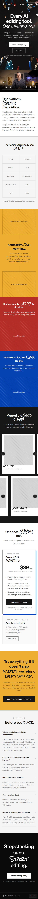

# Prompt Edit — landing page redesign (take-home)

Frontend take-home for **Prompt Edit**: a single-page marketing mock-up replacing the current sales page at [contentcreator.com/prompt-edit](https://www.contentcreator.com/prompt-edit).

**Live mock-up:** [prompt-edit.on-forge.com](https://prompt-edit.on-forge.com/)

**Stack:** Laravel 13, Inertia, Vue 3, Tailwind v4. Page lives in `resources/js/pages/Welcome.vue`. Deployed on Laravel Forge.

# Overview

This is what I would consider a first-pass mock-up completed in about 5.5–6 hours. Typically I would present the client or manager with several mock-ups to choose from earlier on in the process.

I was very inspired by the glass imagery and colors used in the main video on the current website. Two of the UI examples that were suggested were particularly appealing to me, namely Epidemic Sound and Envato. These combined aspects informed my approach to the design.

By happy accident, the video already utilized a set of colors that I believe would translate well into new brand colors. It appears that many AI brands are focusing on either your typical blues or going for less common colors such as chartreuse on Envato and Higgsfield or pink on Epidemic Sound. By utilizing the classic red-blue-yellow color scheme, we call back to more established and professional color language that will inspire more confidence in the product.

I wanted to bring in the bold, fun, and playful style utilized by both Envato and Epidemic Sound while elevating it and also incorporating a more cinematic aspect to make Prompt Edit feel like professional software aligned with DaVinci Resolve and Adobe Premiere Pro that it builds for.

Services like this are by nature extremely information-dense, and I wanted to focus on developing a visual language that could handle this density as a feature instead of a bug and still make all the information very legible.

Moving forward, I would want to develop more sections, possibly expanding the feature cards into separate pages, incorporate existing assets in place of the placeholder images, and redesign some of them in a more flat or color-block style that would appear integrated into the page as they are on Epidemic Sound (I particularly like the existing before-and-after provider-bubbles-into-bucket visual that they would want to incorporate into the updated style).

I would be very interested in working on the project further, particularly developing the UI and UX for the tools themselves. I am a stickler for UX in my day-to-day workflows and have often gone to great lengths to reduce my workflows by one or two clicks.

### Screenshots

Full-page captures:

| 1080p                                                | 1440p                                                |
| ---------------------------------------------------- | ---------------------------------------------------- |
|  |  |

**Mobile**

---

## What this mock-up includes

Built around a cold-traffic funnel (see `reference/audit_takeaway.md` for the section strategy):

| Section        | Intent                                            |
| -------------- | ------------------------------------------------- |
| Hero           | Looping cinematic video BG, single primary CTA    |
| Hook expansion | “One platform…” value prop + supporting video     |
| Provider strip | Tool logos as social proof                        |
| Before / after | Visual contrast (placeholder blocks today)        |
| Plugins        | DaVinci Resolve + Premiere Pro callouts           |
| Features       | Horizontal “polaroid” masonry of capability cards |
| Pricing        | Subscription-first, credit pack as fallback       |
| Guarantee      | De-risk directly under pricing                    |
| FAQ            | Five cold-traffic objections                      |
| Pre-footer CTA | Repeat primary action                             |

**Extras for review:** floating **Tweaks** panel (HSL sliders) to explore palette without redeploying — useful for feedback, not production UI.

All CTAs and nav links are `#` placeholders. Structure follows audit recommendations.

---

## Design rationale

**Inspiration:** Glass and color from Prompt Edit’s existing hero video; layout energy from **Epidemic Sound** and **Envato** (client-provided references). Goal: bold and approachable like those brands, but cinematic enough to sit beside **DaVinci Resolve** and **Premiere Pro**.

**Color:** The hero video already leaned RYB primaries. Many AI products default to blue or altnerative colours such as chartreuse/pink; leaning into classic red–blue–yellow signals a more established, “pro tool” feel while staying distinct.

**Information density:** The product is inherently dense. Instead of hiding that, the layout uses strong color blocks, clear hierarchy, and repeatable card patterns so scanning stays easy at a glance.

**Scope of this pass:** ~5.5–6 hours to a first viable mock-up. In a client engagement I’d normally show 2–3 directions earlier; here I committed to one direction after audit + reference review.

---

## How I worked (process)

1. **Audit** — Full pass on the live page with Claude; outputs in `reference/current_site_audit.md` and `reference/audit_takeaway.md`.
2. **References** — Listed what the client liked (Epidemic Sound, Envato); mapped patterns to steal vs. avoid.
3. **Hero video** — Chose animated BG over static glass still. Claude helped with image prompt; still via Nano Banana → image-to-video (Higgsfield); loop cleanup in Blender.
4. **Asset harvest** — Downloaded existing page images/video with a small script for reference and future integration.
5. **First layout** — Claude Design from audit + new hero; wasn’t satisfied with control/fidelity → moved to **Cursor** for hand-built layout.
6. **Direction** — Settled on color-block sections; implemented core funnel sections manually.
7. **Speed pass** — Returned to Claude Design for extra sections/chrome; cherry-picked what worked, reverted the rest in editor.
8. **Tooling** — Hit Cursor API limits partway through; finished polish in **Zed** with Claude.
9. **Ship** — Fixed GitHub CI, deployed to Forge.

AI sped exploration and draft sections; final structure, spacing, accessibility labels, and component choices were intentional hand work.

---

## Known gaps & next pass

Honest limits of this submission — not blockers for evaluating layout/UX direction:

| Area                 | Status                                                                                                                                                                  |
| -------------------- | ----------------------------------------------------------------------------------------------------------------------------------------------------------------------- |
| Marketing images     | Placeholders throughout (before/after, plugin shots, feature card media). Real assets downloaded under `reference/` but not yet restyled to match color-block language. |
| Hero video           | Concept works; current export has compression/artifact issues — would re-render at higher quality.                                                                      |
| Before/after bubbles | Love the existing “providers → bucket” visual on the live site; would redraw flat/color-block to match Epidemic-style integration.                                      |
| Motion               | Minimal beyond video loops and hover scale. Would add scroll/hover micro-interactions if we push past mock-up.                                                          |
| Feature depth        | Cards are illustrative; could become dedicated subpages or modals later.                                                                                                |

## Reference files

- `reference/current_site_audit.md` — Inventory of the live page
- `reference/audit_takeaway.md` — Funnel strategy and section order this mock-up follows
